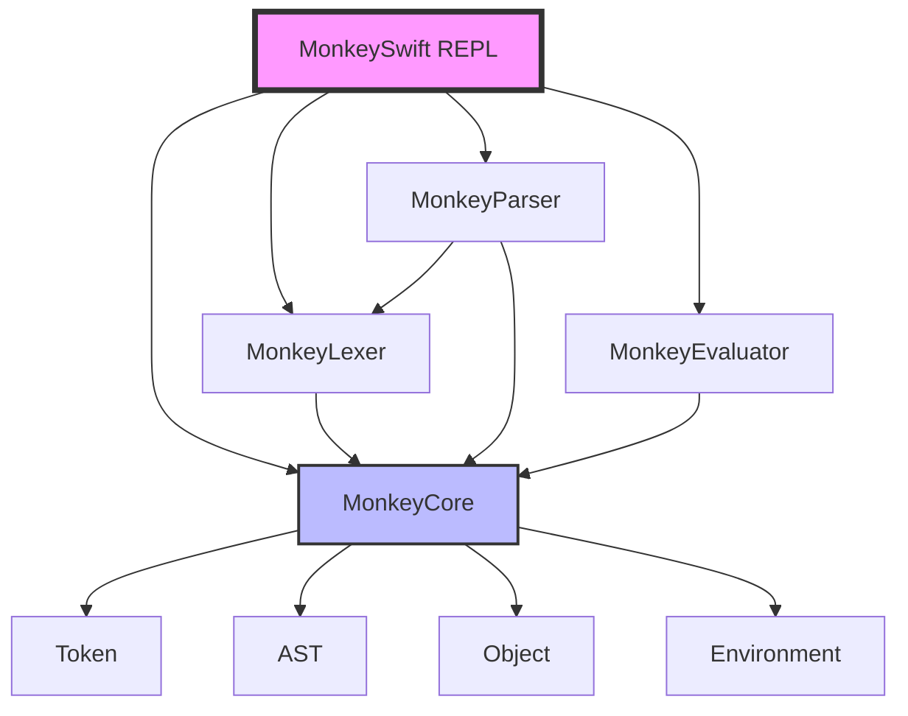

# MonkeySwift 🐒

A Swift implementation of the Monkey programming language interpreter, based on the book ["Writing An Interpreter In Go"](https://interpreterbook.com/) by Thorsten Ball.

## Features

✅ **Complete Interpreter Implementation**
- Lexical analysis (Lexer)
- Syntax analysis (Parser with Pratt parsing)
- Semantic analysis and evaluation (Evaluator)
- Environment for variable bindings
- Interactive REPL

✅ **Modular Architecture**
- SPM (Swift Package Manager) based modularization
- Separate modules for core components
- Comprehensive test coverage

✅ **Language Features**
- Variable bindings (`let` statements)
- Integers and booleans
- Arithmetic expressions (`+`, `-`, `*`, `/`)
- Comparison operators (`<`, `>`, `==`, `!=`)
- Prefix operators (`!`, `-`)
- Conditionals (`if-else`)
- Functions and closures
- First-class and higher-order functions

## Architecture



## Module Structure

### MonkeyCore
Core data structures and protocols:
- **Token**: Token types and definitions
- **AST**: Abstract Syntax Tree node definitions
- **Object**: Runtime object representations
- **Environment**: Variable binding storage

### MonkeyLexer
Lexical analyzer that converts source code into tokens.

### MonkeyParser
Recursive descent parser using Pratt parsing for expressions:
- Parses tokens into an AST
- Supports operator precedence
- Comprehensive error reporting

### MonkeyEvaluator
Tree-walking interpreter that evaluates the AST:
- Evaluates expressions and statements
- Manages function calls and closures
- Error handling and propagation

### MonkeySwift (Executable)
Interactive REPL for running Monkey code.

## Installation

### Requirements
- Swift 6.0+
- macOS 13.0+

### Building

```bash
swift build
```

### Running Tests

```bash
swift test
```

### Running the REPL

```bash
swift run
```

## Usage

### REPL Examples

```monkey
>> let x = 5;
5
>> let y = 10;
10
>> let add = fn(a, b) { a + b };
fn(a, b) {
(a + b)
}
>> add(x, y);
15
>> let fibonacci = fn(n) { if (n < 2) { n } else { fibonacci(n - 1) + fibonacci(n - 2) } };
fn(n) {
if (n < 2) n else (fibonacci((n - 1)) + fibonacci((n - 2)))
}
>> fibonacci(10);
55
>> let newAdder = fn(x) { fn(y) { x + y } };
fn(x) {
fn(y) {
(x + y)
}
}
>> let addTwo = newAdder(2);
fn(y) {
(x + y)
}
>> addTwo(3);
5
```

### Language Examples

#### Variables
```monkey
let age = 25;
let name = "Monkey";
let result = 10 * (20 + 30);
```

#### Functions
```monkey
let add = fn(x, y) {
    x + y;
};

let multiply = fn(x, y) {
    x * y;
};

add(2, 3);  // 5
multiply(4, 5);  // 20
```

#### Conditionals
```monkey
let max = fn(a, b) {
    if (a > b) {
        a
    } else {
        b
    }
};

max(10, 20);  // 20
```

#### Higher-Order Functions
```monkey
let map = fn(arr, f) {
    // Map implementation
};

let double = fn(x) { x * 2 };
map([1, 2, 3], double);  // [2, 4, 6]
```

#### Closures
```monkey
let makeGreeter = fn(greeting) {
    fn(name) {
        greeting + " " + name
    }
};

let hello = makeGreeter("Hello");
hello("World");  // "Hello World"
```

## Implementation Details

### Pratt Parsing
The parser uses Vaughan Pratt's parsing technique for handling operator precedence elegantly:

```
Precedence levels (lowest to highest):
1. LOWEST
2. EQUALS (==, !=)
3. LESSGREATER (<, >)
4. SUM (+, -)
5. PRODUCT (*, /)
6. PREFIX (!, -)
7. CALL (function call)
```

### Object System
Internal representation of runtime values:
- `IntegerObject`: Integer values
- `BooleanObject`: Boolean values
- `NullObject`: Null value
- `ReturnValueObject`: Wrapper for return values
- `ErrorObject`: Error messages
- `FunctionObject`: Function definitions with closures

### Environment
Implements lexical scoping with nested environments:
- Variable storage with hash map
- Outer environment reference for closure support
- Proper scoping for function calls

## Testing

The project includes comprehensive test suites:

- **LexerTests**: Token generation and lexical analysis
- **ParserTests**: AST construction and parsing
- **EvaluatorTests**: Expression evaluation and semantics

Run all tests:
```bash
swift test
```

Run specific test suite:
```bash
swift test --filter LexerTests
swift test --filter ParserTests
swift test --filter EvaluatorTests
```

## Project Structure

```
MonkeySwift/
├── Sources/
│   ├── MonkeyCore/           # Core data structures
│   │   ├── token.swift       # Token definitions
│   │   ├── ast.swift         # AST node definitions
│   │   ├── object.swift      # Runtime objects
│   │   └── environment.swift # Variable bindings
│   ├── MonkeyLexer/          # Lexical analyzer
│   │   └── lexer.swift
│   ├── MonkeyParser/         # Syntax analyzer
│   │   └── parser.swift
│   ├── MonkeyEvaluator/      # Interpreter
│   │   └── evaluator.swift
│   └── MonkeySwift/          # Executable REPL
│       ├── main.swift
│       └── Repl/
│           └── repl.swift
├── Tests/
│   └── MonkeySwiftTests/
│       ├── LexerTests.swift
│       ├── ParserTests.swift
│       └── EvaluatorTests.swift
├── Package.swift
└── README.md
```

## Roadmap

- [x] Token
- [x] Lexer
- [x] REPL
- [x] Parser (Pratt Parsing)
- [x] AST
- [x] Evaluator
- [x] Environment
- [x] Object System
- [x] Comprehensive Tests
- [x] SPM Modularization
- [ ] String support
- [ ] Array support
- [ ] Hash map support
- [ ] Built-in functions
- [ ] DocC documentation
- [ ] GitHub Pages documentation site

## References

- [Writing An Interpreter In Go](https://interpreterbook.com/) by Thorsten Ball
- [Monkey Programming Language](https://monkeylang.org/)
- [Original Monkey Interpreter (Go)](https://github.com/kei-s/monkey)
- [Monkey Swift Reference](https://github.com/kitasuke/monkey-swift)

## License

This project is created for educational purposes.

## Contributing

Contributions are welcome! Please feel free to submit a Pull Request.

## Acknowledgments

Special thanks to Thorsten Ball for the excellent book "Writing An Interpreter In Go" which served as the foundation for this implementation.
