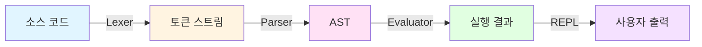
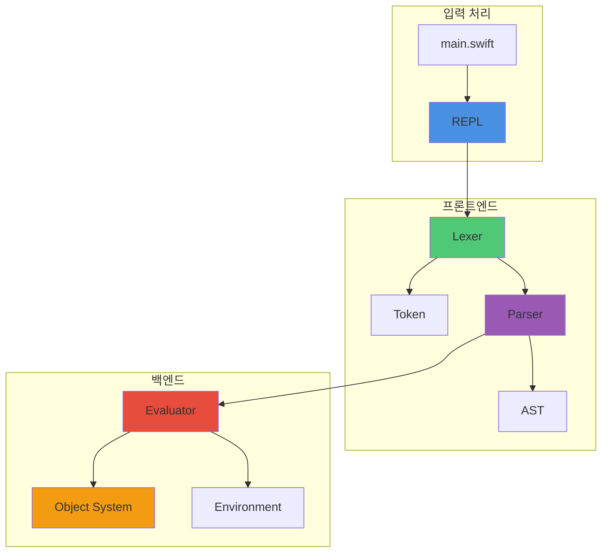
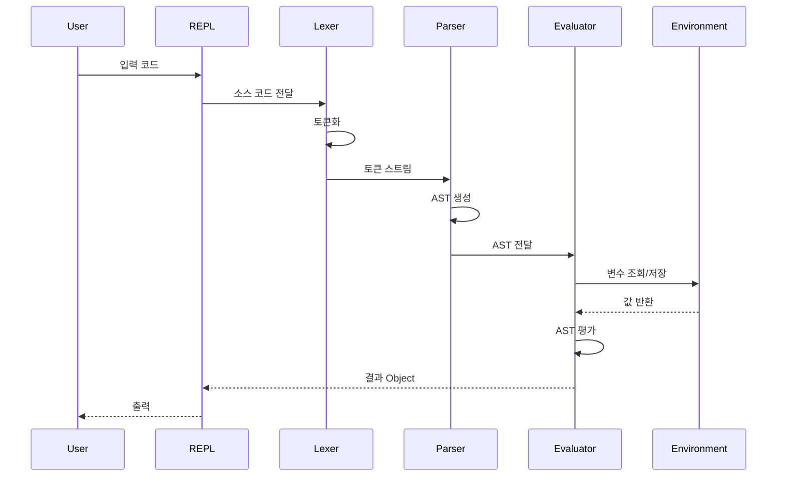
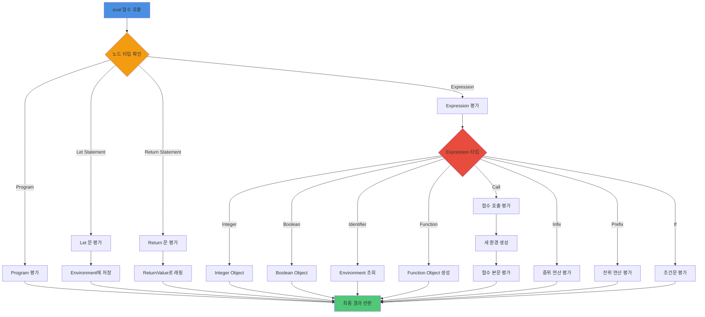
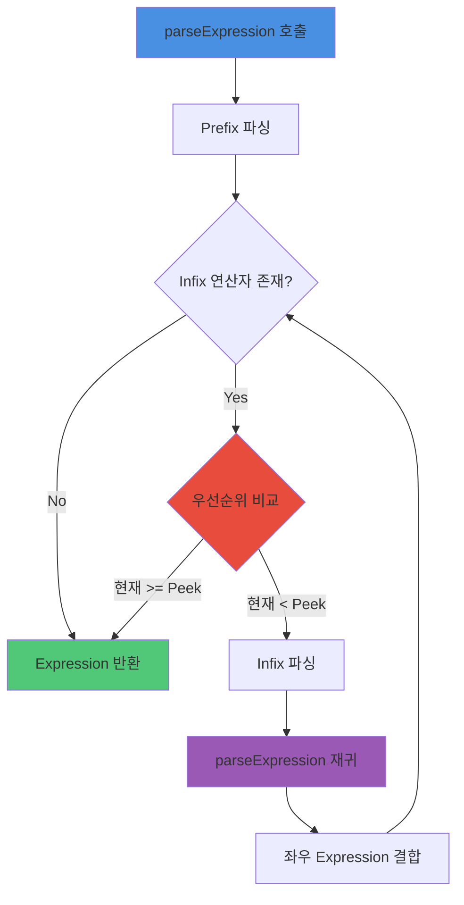

# MonkeySwift 🐵

**Monkey 프로그래밍 언어의 Swift 구현체**

Tree-walking 인터프리터로 구현된 Monkey 언어 인터프리터입니다. "Writing An Interpreter In Go" 책을 기반으로 Swift로 재구현했습니다.

## 목차

- [특징](#특징)
- [아키텍처](#아키텍처)
- [프로젝트 구조](#프로젝트-구조)
- [빌드 및 실행](#빌드-및-실행)
- [언어 기능](#언어-기능)
- [예시 코드](#예시-코드)
- [동작 흐름](#동작-흐름)
- [테스트](#테스트)

## 특징

- ✅ **렉싱 (Lexing)**: 소스 코드를 토큰으로 변환
- ✅ **파싱 (Parsing)**: Pratt Parsing을 사용한 AST 생성
- ✅ **평가 (Evaluation)**: Tree-walking 방식으로 AST 실행
- ✅ **일급 함수 (First-class Functions)**: 함수를 값으로 취급
- ✅ **클로저 (Closures)**: 외부 변수 캡처 지원
- ✅ **정수 연산**: 사칙연산, 비교 연산
- ✅ **불린 연산**: 논리 연산자 지원
- ✅ **조건문**: if-else 표현식
- ✅ **재귀 함수**: 재귀 호출 지원
- ✅ **Swift 6.0 호환**: Strict concurrency 준수

## 아키텍처

MonkeySwift는 전통적인 인터프리터 파이프라인을 따릅니다:



### 컴포넌트 구조



## 프로젝트 구조

```
MonkeySwift/
├── Sources/
│   └── MonkeySwift/
│       ├── Token/
│       │   └── Token.swift          # 토큰 타입 정의
│       ├── Lexer/
│       │   └── Lexer.swift          # 어휘 분석기
│       ├── AST/
│       │   └── AST.swift            # 추상 구문 트리
│       ├── Parser/
│       │   └── Parser.swift         # 구문 분석기 (Pratt Parsing)
│       ├── Object/
│       │   ├── Object.swift         # 런타임 객체 시스템
│       │   └── Environment.swift    # 변수 환경 (스코프)
│       ├── Evaluator/
│       │   └── Evaluator.swift      # 인터프리터 평가기
│       ├── Repl/
│       │   └── Repl.swift           # Read-Eval-Print Loop
│       └── main.swift               # 진입점
│
└── Tests/
    └── MonkeySwiftTests/
        ├── TokenTests.swift         # Token 테스트
        ├── LexerTests.swift         # Lexer 테스트
        ├── ASTTests.swift           # AST 테스트
        ├── ParserTests.swift        # Parser 테스트
        ├── ObjectTests.swift        # Object 테스트
        ├── EvaluatorTests.swift     # Evaluator 테스트
        └── IntegrationTests.swift   # 통합 테스트
```

## 빌드 및 실행

### 요구사항

- Swift 6.0 이상
- macOS, Linux, Windows (Swift 지원 플랫폼)

### 빌드

```bash
# 프로젝트 빌드
swift build

# Release 모드 빌드
swift build -c release
```

### 실행

```bash
# REPL 모드로 실행
swift run

# 또는 빌드된 실행 파일로 직접 실행
.build/debug/MonkeySwift
```

### REPL 사용법

```bash
$ swift run
Hello! This is the Monkey programming language!
Feel free to type in commands
>> let x = 5;
5
>> let y = 10;
10
>> x + y
15
>> exit
Goodbye!
```

## 언어 기능

### 1. 변수 바인딩

```monkey
let x = 5;
let y = 10;
let name = x + y;
```

### 2. 정수 연산

```monkey
5 + 5;           // 10
10 - 5;          // 5
5 * 5;           // 25
10 / 2;          // 5
```

### 3. 비교 연산

```monkey
5 < 10;          // true
5 > 10;          // false
5 == 5;          // true
5 != 10;         // true
```

### 4. 불린 연산

```monkey
!true;           // false
!false;          // true
!!true;          // true
```

### 5. 조건문

```monkey
if (x > 5) {
    10
} else {
    20
}
```

### 6. 함수 정의 및 호출

```monkey
let add = fn(a, b) {
    a + b
};

add(5, 10);      // 15
```

### 7. 고차 함수

```monkey
let twice = fn(f, x) {
    f(f(x))
};

let addTwo = fn(x) {
    x + 2
};

twice(addTwo, 1);  // 5
```

### 8. 클로저

```monkey
let newAdder = fn(x) {
    fn(y) {
        x + y
    }
};

let addTwo = newAdder(2);
addTwo(3);         // 5
```

### 9. 재귀 함수

```monkey
let factorial = fn(n) {
    if (n == 0) {
        1
    } else {
        n * factorial(n - 1)
    }
};

factorial(5);      // 120
```

## 예시 코드

### 피보나치 수열

```monkey
let fibonacci = fn(x) {
    if (x == 0) {
        0
    } else {
        if (x == 1) {
            1
        } else {
            fibonacci(x - 1) + fibonacci(x - 2)
        }
    }
};

fibonacci(10);  // 55
```

### 최대값 찾기

```monkey
let max = fn(a, b) {
    if (a > b) {
        a
    } else {
        b
    }
};

max(10, 20);  // 20
```

### 카운터 클로저

```monkey
let newCounter = fn() {
    let count = 0;
    fn(increment) {
        if (increment) {
            count = count + 1
        }
        count
    }
};

let counter = newCounter();
counter(true);   // 1
counter(true);   // 2
counter(false);  // 2
```

### 고차 함수 - Map

```monkey
let map = fn(arr, f) {
    let iter = fn(arr, accumulated) {
        if (len(arr) == 0) {
            accumulated
        } else {
            iter(rest(arr), push(accumulated, f(first(arr))))
        }
    };
    iter(arr, [])
};

let double = fn(x) { x * 2 };
map([1, 2, 3, 4], double);  // [2, 4, 6, 8]
```

## 동작 흐름

### 전체 실행 흐름



### 평가 과정 상세



### Parser의 Pratt Parsing 흐름



## 테스트

### 전체 테스트 실행

```bash
swift test
```

### 개별 테스트 실행

```bash
# Lexer 테스트만 실행
swift test --filter LexerTests

# Parser 테스트만 실행
swift test --filter ParserTests

# Evaluator 테스트만 실행
swift test --filter EvaluatorTests
```

### 테스트 커버리지

- **TokenTests**: 토큰 타입 및 리터럴 변환
- **LexerTests**: 어휘 분석 (숫자, 식별자, 연산자, 키워드)
- **ASTTests**: AST 노드 생성 및 출력
- **ParserTests**: 구문 분석 (statements, expressions, 연산자 우선순위)
- **ObjectTests**: 객체 시스템 및 Environment 스코프
- **EvaluatorTests**: 평가 (연산, 함수, 클로저, 재귀, 에러 처리)
- **IntegrationTests**: 전체 파이프라인 통합 테스트

### 테스트 통계

```
✅ Token: 3 tests
✅ Lexer: 5 tests
✅ AST: 17 tests
✅ Parser: 15 tests
✅ Object: 8 tests
✅ Evaluator: 12 tests
✅ Integration: 10 tests
───────────────────────
📊 Total: 70+ tests
```

## 기술적 세부사항

### Token

모든 토큰은 `TokenType` enum으로 표현됩니다:

```swift
public enum TokenType: Equatable, Sendable {
    case identifier(name: String)
    case int(value: Int)
    case plus, minus, asterisk, slash
    case lessThan, greaterThan, equal, notEqual
    case `let`, `return`, `if`, `else`, `function`
    // ...
}
```

### AST 노드

AST는 프로토콜 기반 계층 구조로 설계되었습니다:

```swift
protocol Node: Sendable {
    var tokenLiteral: String { get }
    func string() -> String
}

protocol Statement: Node {}
protocol Expression: Node {}
```

### Object System

런타임 값들은 `Object` 프로토콜을 구현합니다:

```swift
protocol Object: Sendable {
    var type: ObjectType { get }
    func inspect() -> String
}

// Integer, Boolean, Null, Function, ReturnValue, ErrorObject
```

### Environment (변수 스코프)

클로저와 스코프 체인을 지원하는 환경:

```swift
class Environment {
    private var store: [String: any Object]
    private let outer: Environment?

    func get(_ name: String) -> (any Object)?
    func set(_ name: String, _ value: any Object)
}
```

## 참고 자료

- 📖 [Writing An Interpreter In Go](https://interpreterbook.com/) - Thorsten Ball
- 🦅 [Swift Programming Language](https://swift.org/)
- 🐵 [Monkey Language Specification](https://monkeylang.org/)

## 라이선스

This project is educational and based on the Monkey language from "Writing An Interpreter In Go".

## 기여

Issue와 Pull Request를 환영합니다!

---

**MonkeySwift** - A tree-walking interpreter written in Swift 🐵✨
