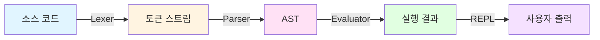
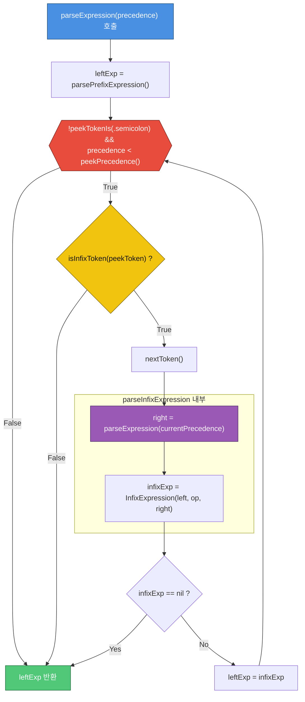

# MonkeySwift 🐵

**Monkey 프로그래밍 언어의 Swift 구현체**

Monkey 언어 인터프리터입니다. "Writing An Interpreter In Go" 책을 기반으로 Swift로 재구현했습니다.

## 목차

- [빌드 및 실행](#빌드-및-실행)
- [특징](#특징)
- [언어 기능](#언어-기능)
- [주요 흐름](#주요-흐름)
- [주요 구성요소](#주요-구성요소)

## 빌드 및 실행

### 요구사항

- Swift 6.0 이상
- macOS, Linux, Windows (Swift 지원 플랫폼)

### 빌드

```bash
# 프로젝트 빌드
swift build

# Release 모드 빌드
swift build -c release
```

### 실행

```bash
# REPL 모드로 실행
swift run

# 또는 빌드된 실행 파일로 직접 실행
.build/debug/MonkeySwift
```

### REPL 사용법

```bash
$ swift run
Hello! This is the Monkey programming language!
Feel free to type in commands
>> let x = 5;
5
>> let y = 10;
10
>> x + y
15
>> exit
Goodbye!
```

## 특징

- **렉싱 (Lexing)**: 소스 코드를 토큰으로 변환
- **파싱 (Parsing)**: Pratt Parsing을 사용한 AST 생성
- **평가 (Evaluation)**: Tree-walking 방식으로 AST 실행
- **일급 함수 (First-class Functions)**: 함수를 값으로 취급
- **정수 연산**: 사칙연산, 비교 연산
- **불린 연산**: 논리 연산자 지원
- **조건문**: if-else 표현식

### MonkeySwift는 전통적인 인터프리터 파이프라인을 따릅니다:



## 언어 기능

### 1. 변수 바인딩

```monkey
let x = 5;
let y = 10;
let name = x + y;
```

### 2. 정수 연산

```monkey
5 + 5;           // 10
10 - 5;          // 5
5 * 5;           // 25
10 / 2;          // 5
```

### 3. 비교 연산

```monkey
5 < 10;          // true
5 > 10;          // false
5 == 5;          // true
5 != 10;         // true
```

### 4. 불린 연산

```monkey
!true;           // false
!false;          // true
!!true;          // true
```

### 5. 조건문

```monkey
if (x > 5) {
    10
} else {
    20
}
```

### 6. 함수 정의 및 호출

```monkey
let add = fn(a, b) {
    a + b
};

add(5, 10);      // 15
```

### 7. 고차 함수


```monkey
let twice = fn(f, x) {
    f(f(x))
};

let addTwo = fn(x) {
    x + 2
};

twice(addTwo, 1);  // 5
```

### 8. 재귀 함수

```monkey
let factorial = fn(n) {
    if (n == 0) {
        1
    } else {
        n * factorial(n - 1)
    }
};

factorial(5);      // 120
```

## 주요 흐름

### Pratt Parsing(Expression Statement 부분)



## 주요 구성요소

### Token

모든 토큰은 `TokenType` enum으로 표현됩니다:

```swift
public enum TokenType: Equatable, Sendable {
    case identifier(name: String)
    case int(value: Int)
    case plus, minus, asterisk, slash
    case lessThan, greaterThan, equal, notEqual
    case `let`, `return`, `if`, `else`, `function`
    // ...
}
```

### AST 노드

AST는 프로토콜 기반 계층 구조로 설계되었습니다:

```swift
protocol Node: Sendable {
    var tokenLiteral: String { get }
    func string() -> String
}

protocol Statement: Node {}
protocol Expression: Node {}
```

#### 1. 기본 값 (Literals)

| 타입             | 예시                 | 코드구조 (Struct)        | 설명             |
|------------------|----------------------|---------------------------|------------------|
| Identifier       | x, myVar             | token, value: String      | 변수 이름 식별자 |
| IntegerLiteral   | 5, 100               | token, value: Int         | 정수 숫자        |
| BooleanLiteral   | true, false          | token, value: Bool        | 참/거짓 값       |


#### 2. 연산자 식 (Operator Expressions)

| 타입              | 예시               | 코드구조 (Struct)                            | 설명                              |
|-------------------|--------------------|----------------------------------------------|-----------------------------------|
| PrefixExpression  | -5, !true          | token, operatorSymbol, right: Expression     | 전위 연산자 + 식 (오른쪽 항 하나) |
| InfixExpression   | 5 + 5, x == y      | token, left, operatorSymbol, right           | 식 + 중위 연산자 + 식 (양쪽 항)   |


#### 3. 제어 흐름 및 함수 (Control Flow & Functions)

| 타입             | 예시                              | 코드구조 (Struct)                                        | 설명                               |
|------------------|-----------------------------------|----------------------------------------------------------|------------------------------------|
| IfExpression     | if (x < y) { x } else { y }      | token, condition, consequence, alternative?              | 조건문 (monkey에선 값을 반환하는 식) |
| FunctionLiteral  | fn(x, y) { x + y }               | token, parameters: [Identifier], body                    | 함수 정의 (파라미터 목록 + 바디)    |
| CallExpression   | add(1, 2)                        | token, function, arguments: [Expression]                 | 함수 호출 (함수 식 + 인자 목록)

### Object System

런타임 값들은 `Object` 프로토콜을 구현합니다:

```swift
protocol Object: Sendable {
    var type: ObjectType { get }
    func inspect() -> String
}

// Integer, Boolean, Null, Function, ReturnValue, ErrorObject
```

### Environment (변수 스코프)

클로저와 스코프 체인을 지원하는 환경:

```swift
class Environment {
    private var store: [String: any Object]
    private let outer: Environment?

    func get(_ name: String) -> (any Object)?
    func set(_ name: String, _ value: any Object)
}
```

## 참고

- 📖 [Writing An Interpreter In Go](https://interpreterbook.com/) - Thorsten Ball
