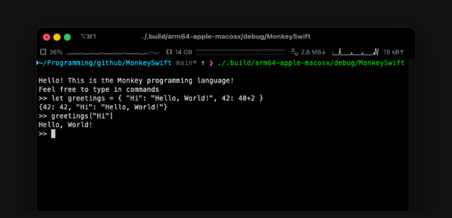
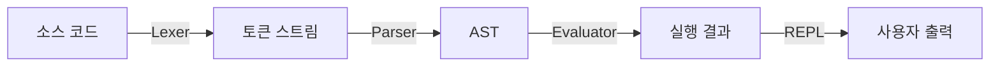
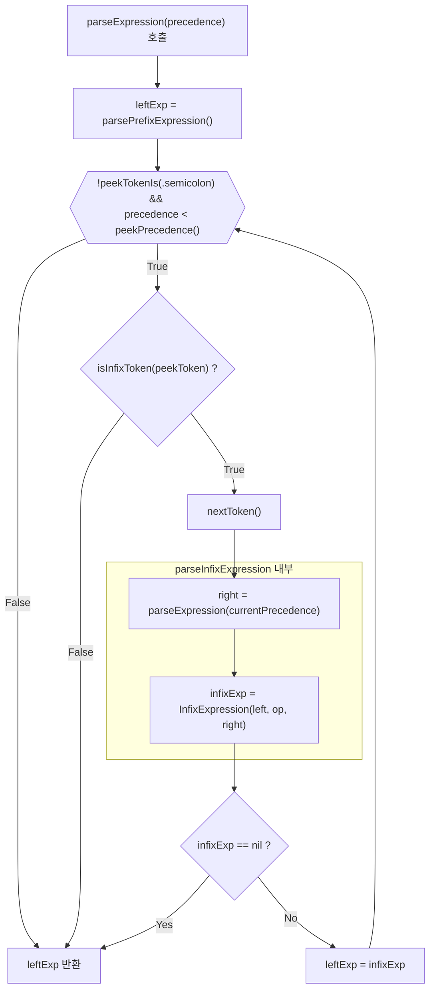
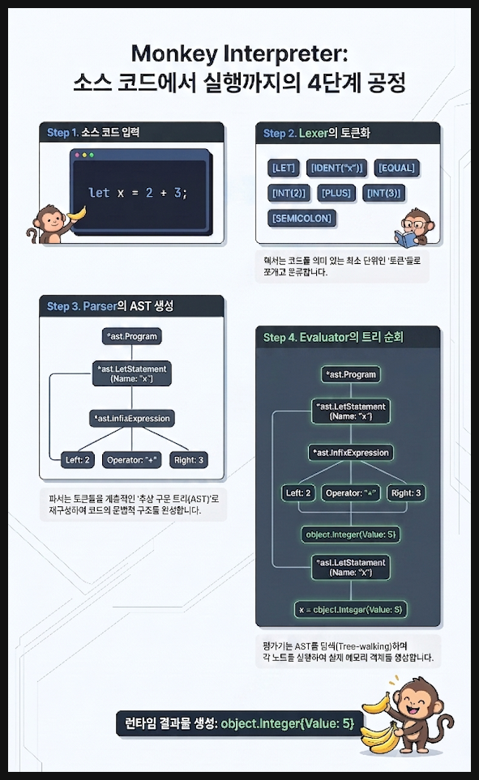

# MonkeySwift 🐵

## Monkey 프로그래밍 언어의 Swift 구현체

**[Writing An Interpreter In Go](https://interpreterbook.com/)** 책 내용을 기반으로 Swift로 구현되었습니다.



## 목차

- [빌드 및 실행](#빌드-및-실행)
- [특징](#특징)
- [언어 기능](#언어-기능)
- [주요 흐름](#주요-흐름)
- [주요 구성요소](#주요-구성요소)

## 빌드 및 실행

### 요구사항

- Swift 6.0 이상
- macOS, Linux, Windows (Swift 지원 플랫폼)

### 빌드

```bash
# 프로젝트 빌드
swift build

# Release 모드 빌드
swift build -c release
```

### 실행

```bash
# REPL 모드로 실행
swift run

# 또는 빌드된 실행 파일로 직접 실행
.build/debug/MonkeySwift
```

### REPL 사용법

```bash
$ swift run
Hello! This is the Monkey programming language!
Feel free to type in commands
>> let x = 5;
5
>> let y = 10;
10
>> x + y
15
>> exit
Goodbye!
```

## 구현

- [x] **렉싱 (Lexing)**: 소스 코드를 토큰으로 변환
- [x] **파싱 (Parsing)**: Pratt Parsing을 사용한 AST 생성
- [x] **평가 (Evaluation)**: Tree-walking 방식으로 AST 실행
- [x] **일급 함수 (First-class Functions)**: 함수를 값으로 취급
- [x] **연산 (Operations)**: 사칙, 비교, 논리 연산 지원
- [x] **조건문 (Control Flow)**: if-else 표현식
- [x] **배열 (Array)**: 배열 리터럴 및 인덱스 접근 지원
- [x] **문자열 (String)**: 문자열 리터럴 지원
- [x] **해시맵 (HashMap)**: 딕셔너리 리터럴 및 인덱스 접근 지원
- [x] **빌트인 함수 (Builtin Functions)**: len, first, last, push, rest(pop), puts 지원
- [ ] VM 구현

### MonkeySwift는 전통적인 인터프리터 파이프라인을 따릅니다:



## 언어 기능

- 현재 REPL은 여러 줄 입력을 제대로 지원하지 않습니다.

### 1. 변수 바인딩

```monkey
let x = 5;
let y = 10;
let name = x + y;
```

### 2. 정수 연산

```monkey
5 + 5;           // 10
10 - 5;          // 5
5 * 5;           // 25
10 / 2;          // 5
```

### 3. 비교 연산

```monkey
5 < 10;          // true
5 > 10;          // false
5 == 5;          // true
5 != 10;         // true
```

### 4. 불린 연산

```monkey
!true;           // false
!false;          // true
!!true;          // true
```

### 5. 조건문

```monkey
if (x > 5) {
    10
} else {
    20
}
```

### 6. 함수 정의 및 호출

```monkey
let add = fn(a, b) {
    a + b
};

add(5, 10);      // 15
```

### 7. 고차 함수

```monkey
let twice = fn(f, x) {
    f(f(x))
};

let addTwo = fn(x) {
    x + 2
};

twice(addTwo, 1);  // 5
```

### 8. 재귀 함수

```monkey
let factorial = fn(n) {
    if (n == 0) {
        1
    } else {
        n * factorial(n - 1)
    }
};

factorial(5);      // 120
```

### 9. 문자열 리터럴

```monkey
let hello = "Hello, world!";
hello;             // Hello, world!
```

### 10. 배열

```monkey
let arr = [1, 2, 3];
arr[0];            // 1
arr[777];          // nil
```

### 11. HashMap

```monkey
let dict = {"name": "Monkey", true: 10};

dict["name"];      // Monkey
dict[true];        // 10
dict["bar"];       // nil
```

### 12. 내장 함수 (Builtin Functions)

```monkey
len("hello");     // 5
len([1, 2, 3]);   // 3

first([1, 2, 3]); // 1
last([1, 2, 3]);  // 3
rest([1, 2, 3]);  // [2, 3]
push([1, 2], 3);  // [1, 2, 3]

puts("Hello");    // 콘솔에 "Hello" 출력
```

## 주요 흐름

### Pratt Parsing(Expression Statement 부분)



## 주요 구성요소 및 관계

MonkeySwift는 각 단계마다 **입력 구조**와 **변환 결과**가 1:1에 가깝게 대응되는 명확한 파이프라인을 가지고 있습니다.

| 단계                  | 원시 데이터 (도구)     | ➡️  | 구조화된 결과 (결과물)      |
| :-------------------- | :--------------------- | :-: | :-------------------------- |
| **렉싱 (Lexing)**     | 소스 코드 (`Lexer`)    | ➡️  | 토큰 스트림 (`TokenType`)   |
| **파싱 (Parsing)**    | 토큰 스트림 (`Parser`) | ➡️  | 추상 구문 트리 (`AST Node`) |
| **평가 (Evaluation)** | AST (`Evaluator`)      | ➡️  | 런타임 값 (`Object`)        |



---

### 1. Token & Lexer

`Lexer`는 문자열 소스코드를 문자 단위로 훑으며 `TokenType`을 생성합니다.

```swift
public enum TokenType: Equatable, Sendable {
    case identifier(name: String)
    case int(value: Int)
    case string(value: String) // 👈 문자열 리터럴 토큰
    case plus, minus, asterisk, slash
    case lessThan, greaterThan, equal, notEqual
    case `let`, `return`, `if`, `else`, `function`
    // ...
}
```

### 2. AST & Parser

`Parser`는 `TokenType` 스트림을 받아 문법적 우선순위(Pratt Parsing)에 맞춰 AST 노드를 구축합니다.

```swift
protocol Node: Sendable {
    var tokenLiteral: String { get }
    func string() -> String
}

protocol Statement: Node {}
protocol Expression: Node {}

// 예: "Hello, world!" 파싱 시 아래의 AST 노드 생성
public struct StringLiteral: Expression, Sendable {
    public let token: TokenType  // .string 토큰
    public let value: String
}
```

### 3. Object & Evaluator

`Evaluator`는 파싱 완료된 AST 트리를 순회(`eval`)하며, 프로그램 내부에서 계산된 런타임 결과값인 `Object`를 만듭니다.

```swift
// 모든 런타임 데이터는 Object 프로토콜을 따릅니다.
public protocol Object: Sendable {
    var type: ObjectType { get }
    func inspect() -> String
}

// 예: StringLiteral AST 노드를 평가하면 StringObject가 생성됩니다.
public struct StringObject: Object {
    public let value: String
    public var type: ObjectType { .string }
    public func inspect() -> String { value }
}
```

### 4. Environment (변수 스코프)

변수의 할당 및 조회 스코프 체인을 유지하는 환경 객체입니다:

```swift
public class Environment {
    private var store: [String: any Object]
    private let outer: Environment?

    public func get(_ name: String) -> (any Object)?
    public func set(_ name: String, _ value: any Object)
}
```

## 상세 구성요소

### 1. Lexing 계층 (Token & Lexer)

- **`Lexer`**: 문자열 소스코드를 한 자씩 탐색하며 유의미한 토큰 스트림으로 변환하는 변형기
- **`TokenType`**: 소스코드에서 분리해 낸 어휘들의 최종 분류를 나타내는 값 타입
  - **`TokenSymbol`**: 문자(Character) 형태의 연산자나 기호를 토큰 매핑하기 위한 내부 열거형 (예: `=`, `+`, `(`, `{` 등)
  - **`TokenKeyword`**: `let`, `fn`, `if`, `else`, `return` 등 미리 정의된 문자열 예약어를 다루는 내부 열거형

---

### 2. Parsing 계층 (AST & Parser)

- **`Parser`**: Pratt Parsing 기법을 기반으로 토큰 스트림을 추상 구문 트리(AST)로 구체화하는 분석기
- **`Node`**: AST를 구성하는 모든 노드가 구현해야 하는 최상위 프로토콜
  - **`Statement (구문 노드)`**: 값을 반환하지 않고 특정 동작을 수행하는 코드 블록
    - **`Program`**: 여러 구문(`Statement`)을 자식으로 갖는 AST의 최상위 루트 노드
    - **`LetStatement`**: `let x = 5;` 형태의 변수 선언 및 바인딩 구문
    - **`ReturnStatement`**: `return 5;` 형태의 조기 반환 구문
    - **`ExpressionStatement`**: 단독으로 사용되는 식(Expression)을 감싸 구문(Statement)으로 취급되도록 돕는 래퍼
    - **`BlockStatement`**: `{ statements }` 형태의 중괄호로 둘러싸인 구문들의 묶음
  - **`Expression (식 노드)`**: 평가 시 특정 런타임 결과값(`Object`)을 생성 및 반환하는 노드
    - **리터럴 (Literal)**
      - **`Identifier`**: 변수명, 함수명 등의 식별자를 가리키는 식
      - **`IntegerLiteral`**: 소스코드 내 정수 값(예: `5`, `10`)을 저장하는 노드
      - **`StringLiteral`**: 소스코드 내 문자열 값(예: `"hello"`)을 저장하는 노드
      - **`BooleanLiteral`**: 참(`true`) 또는 거짓(`false`)의 값을 저장하는 노드
      - **`ArrayLiteral`**: `[1, 2 * 2]` 형태의 배열 정의 식
    - **연산자 식 (Operator Expression)**
      - **`PrefixExpression`**: `!`, `-`와 같이 식 앞에 접두사로 붙는 단항 연산 식
      - **`InfixExpression`**: `+`, `-`, `==` 등 좌우 두 식 사이에 위치하는 이항 연산 식
      - **`IndexExpression`**: `arr[index]` 형태의 배열 인덱스 접근 식
    - **제어 흐름 및 함수 (Control Flow & Function)**
      - **`IfExpression`**: 조건부 분기 처리를 통해 결과값을 반환하는 조건 식
      - **`FunctionLiteral`**: 매개변수와 블록 구문으로 이루어진 익명 함수 선언 식
      - **`CallExpression`**: 식별자 또는 함수 리터럴을 인자들과 함께 실행하는 함수 호출 식

---

### 3. Evaluation 계층 (Object & Evaluator)

- **`eval`**: AST 노드를 재귀적으로 탐색하여 이에 알맞은 런타임 `Object`로 환원하는 주입식 평가기
  - **제어 흐름 처리**: `IfExpression`과 같은 조건부 식을 평가할 때, 조건의 참/거짓 여부에 따라 consequence 혹은 alternative 블록으로 평가 흐름을 분기함
- **`Environment`**: 변수의 이름(Key)과 런타임 값(Value)을 매핑하고 부모 스코프 체인을 관리하는 클래스
- **`Object`**: 모든 런타임 데이터 값을 표현하는 최상위 프로토콜
  - **`ObjectType`**: 런타임 결과물인 각 `Object`들의 실질적 데이터 타입을 매핑한 열거형
  - **기본 타입 값 (Value Object)**
    - **`Integer`**: 정수 값을 나타내는 런타임 객체
    - **`StringObject`**: 문자열 값을 나타내는 런타임 객체
    - **`Boolean`**: 불린 논리 값을 나타내는 런타임 객체
    - **`Null`**: 값이 존재하지 않음을 나타내는 객체 (`if` 조건 불일치 시 alternative 블록이 없을 때 기본 반환값으로도 쓰임)
    - **`ArrayObject`**: 평가가 끝난 다른 런타임 객체들을 요소로 포함하는 배열 객체
  - **흐름 제어 및 오류 (Control & Error)**
    - **`ReturnValue`**: 호출 스택에서 반환 흐름을 나타내기 위한 래퍼 객체
    - **`ErrorObject`**: 런타임 오류 및 추적 메시지를 저장하는 에러 객체
  - **함수 및 클로저 (Function & Closure)**
    - **`Function`**: 매개변수 정보, 수행할 바디 식, 선언 시점 스코프 환경을 캡슐화한 일급 객체
