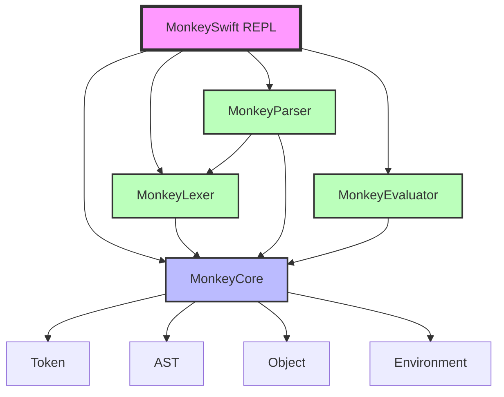
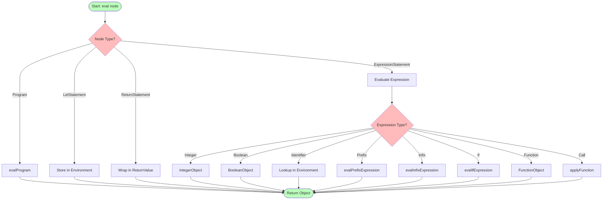
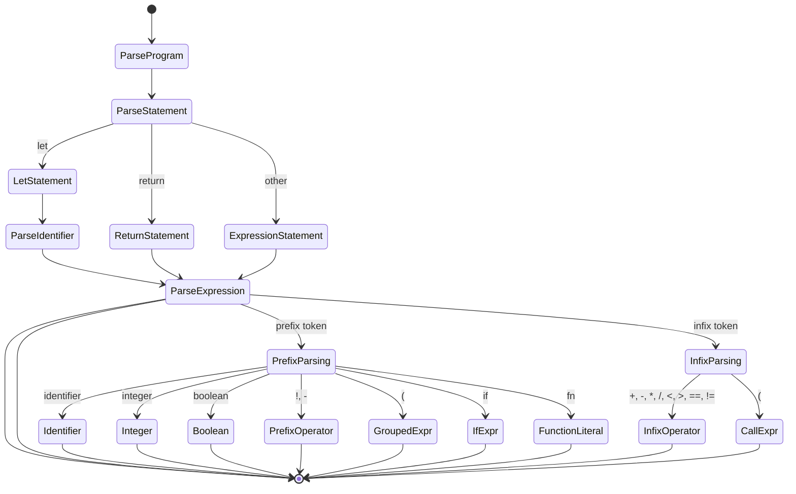
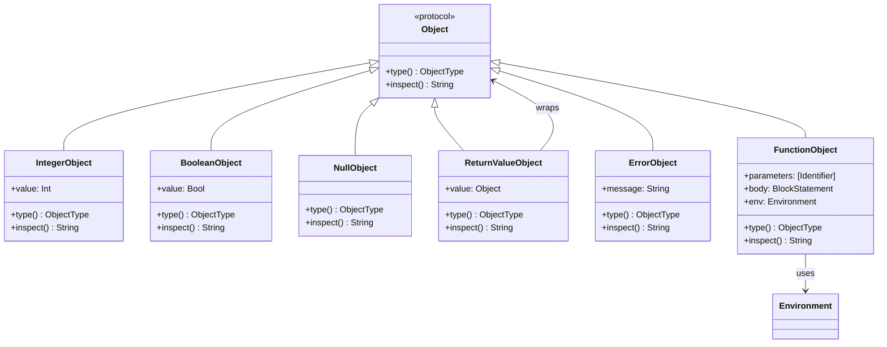
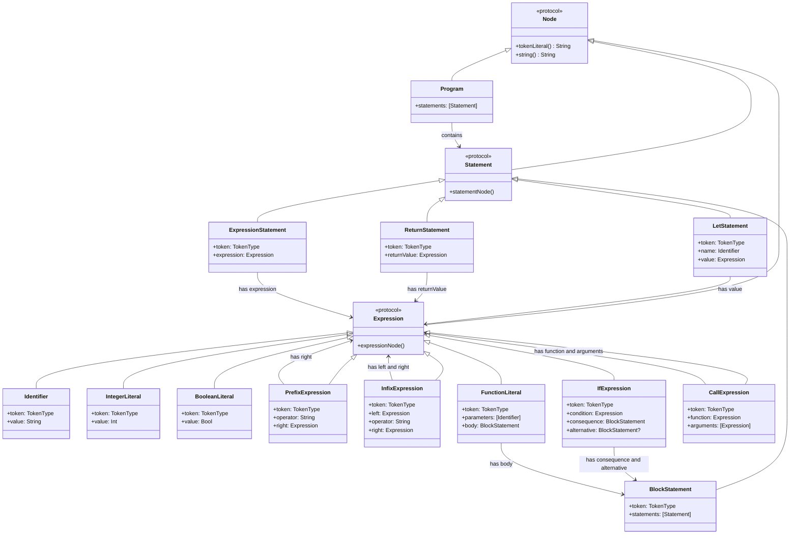
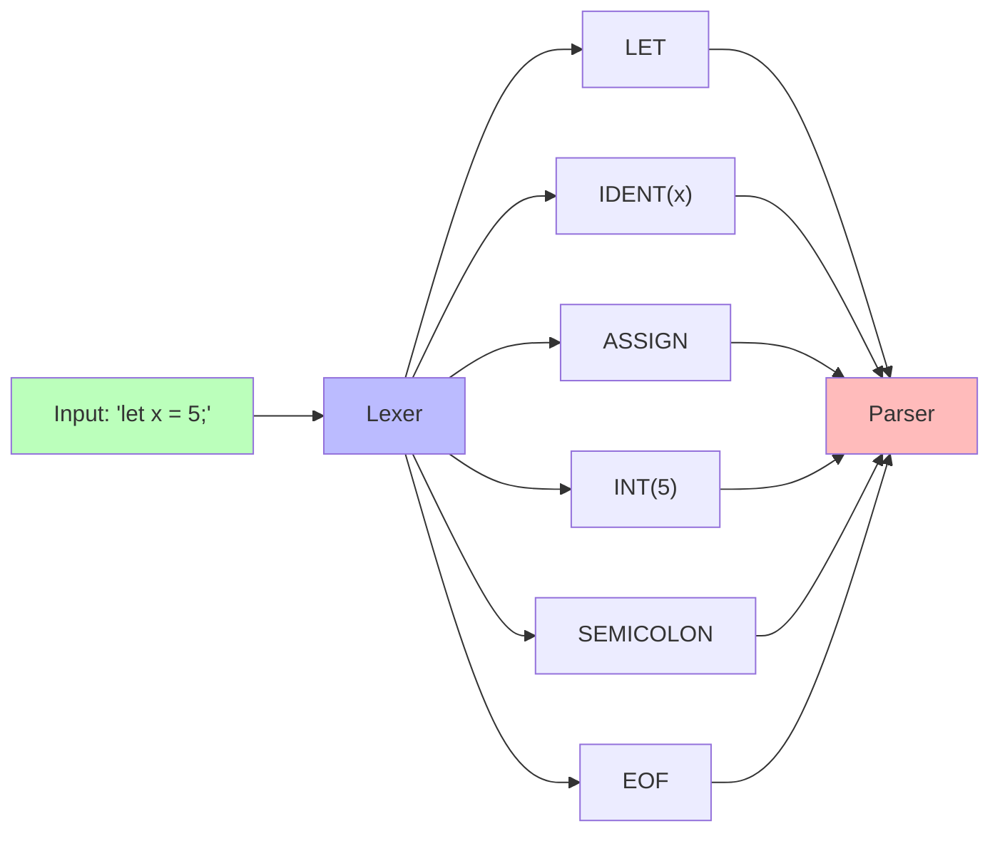
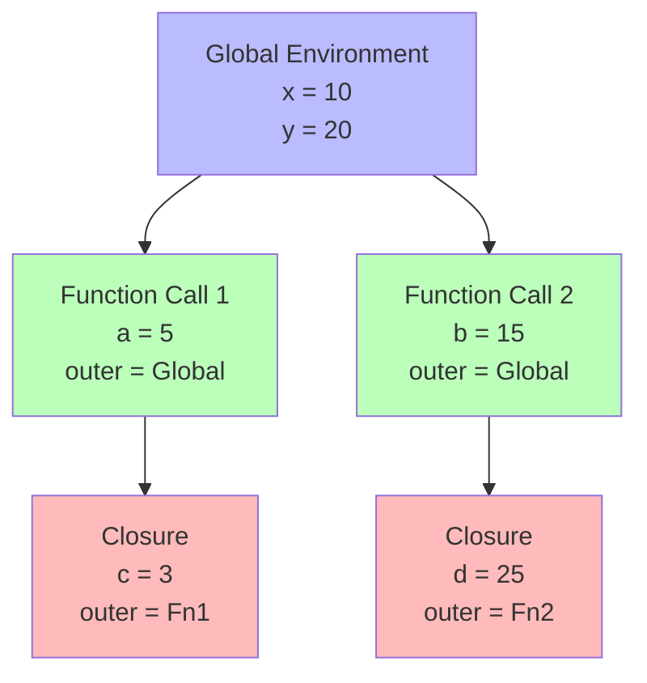

# MonkeySwift Architecture

## Module Dependency Graph



## Data Flow

```mermaid
sequenceDiagram
    participant User
    participant REPL
    participant Lexer
    participant Parser
    participant Evaluator
    participant Environment

    User->>REPL: Input: "let x = 5;"
    REPL->>Lexer: Tokenize
    Lexer->>REPL: [LET, IDENT(x), ASSIGN, INT(5), SEMICOLON]
    REPL->>Parser: Parse tokens
    Parser->>REPL: AST (LetStatement)
    REPL->>Evaluator: Evaluate AST
    Evaluator->>Environment: Set("x", IntegerObject(5))
    Environment->>Evaluator: IntegerObject(5)
    Evaluator->>REPL: IntegerObject(5)
    REPL->>User: "5"
```

## Evaluation Flow



## Parser State Machine



## Object Type Hierarchy



## AST Node Hierarchy



## Token Flow Through Lexer



## Environment Scoping


